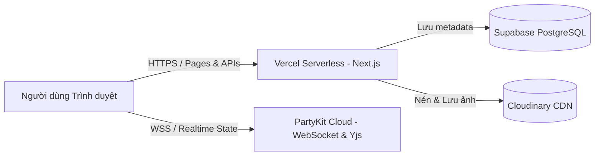

# 🎮 ArcadeDocs

<div align="center">

[](https://arcadedocs.dev/)
[](https://nextjs.org/)
[](https://react.dev/)
[](https://www.typescriptlang.org/)
[](https://tailwindcss.com/)
[](https://partykit.io/)
[](https://yjs.dev/)
[](LICENSE)

<br />

**Trình soạn thảo văn bản & Bảng vẽ Canvas vô tận cộng tác thời gian thực**  
*Kết hợp sức mạnh của Google Docs, Miro và phong cách Retro Arcade 8-Bit độc đáo.*

[Trải nghiệm trực tiếp tại **arcadedocs.dev**](https://arcadedocs.dev/) • [Báo lỗi & Góp ý](https://github.com/Ming3210/ArcadeDocs/issues)

</div>

---

## 📖 Mục lục

- [Tổng quan](#-tổng-quan)
- [Tính năng nổi bật](#-tính-năng-nổi-bật)
  - [1. Trình soạn thảo văn bản thời gian thực (/doc/[id])](#1-trình-soạn-thảo-văn-bản-thời-gian-thực-docid)
  - [2. Bản PRO: 8-Bit Infinite Canvas Playground (/pro/[id])](#2-bản-pro-8-bit-infinite-canvas-playground-proid)
  - [3. Hệ thống đồng bộ CRDT & WebSocket](#3-hệ-thống-đồng-bộ-crdt--websocket)
  - [4. Quản lý tệp, quyền truy cập & Lưu trữ đám mây](#4-quản-lý-tệp-quyền-truy-cập--lưu-trữ-đám-mây)
- [Kiến trúc công nghệ (Tech Stack)](#-kiến-trúc-công-nghệ-tech-stack)
- [Cấu trúc thư mục dự án](#-cấu-trúc-thư-mục-dự-án)
- [Hướng dẫn cài đặt & Chạy cục bộ](#-hướng-dẫn-cài-đặt--chạy-cục-bộ)
- [Cấu hình biến môi trường (.env.local)](#-cấu-hình-biến-môi-trường-envlocal)
- [Hướng dẫn triển khai (Deployment)](#-hướng-dẫn-triển-khai-deployment)
  - [1. Triển khai WebSocket Server (PartyKit)](#1-triển-khai-websocket-server-partykit)
  - [2. Triển khai Frontend & API (Vercel)](#2-triển-khai-frontend--api-vercel)
- [Các câu lệnh có sẵn (Scripts)](#-các-câu-lệnh-có-sẵn-scripts)
- [Giấy phép (License)](#-giấy-phép-license)

---

## 🌟 Tổng quan

**ArcadeDocs** là nền tảng cộng tác trực tuyến hiện đại cho phép nhiều người dùng đồng thời làm việc trên tài liệu văn bản hoặc cùng lên ý tưởng, vẽ sơ đồ trên một bảng vẽ vô tận (infinite canvas).

Điểm khác biệt của ArcadeDocs:
- **Độ trễ cực thấp & Không xung đột dữ liệu:** Ứng dụng thuật toán **CRDT (Conflict-free Replicated Data Types)** thông qua **Yjs**, phối hợp với kiến trúc **Durable Objects / WebSocket** của **PartyKit**.
- **Trải nghiệm kép độc đáo:**
  - Chế độ **Tài liệu chuẩn (Doc Editor)**: Giao diện sạch sẽ, thanh lịch, tinh gọn tương tự Google Docs / Notion.
  - Chế độ **Bản PRO Retro 8-Bit (Playground Canvas)**: Bảng vẽ vô tận phong cách Arcade cổ điển với bot pixel, hiệu ứng âm thanh/hình ảnh neon sống động, phù hợp cho brainstorming, mindmap và sơ đồ kỹ thuật.

---

## ✨ Tính năng nổi bật

### 1. Trình soạn thảo văn bản thời gian thực (`/doc/[id]`)
- **Cộng tác nhiều người (Multiplayer Collaboration):**
  - Đồng bộ tức thì từng ký tự mà không xảy ra xung đột nội dung.
  - Hiển thị vị trí con trỏ chuột trực tiếp (Live Collaboration Cursors) kèm tên và màu sắc riêng biệt của từng thành viên.
  - Thanh trạng thái hiển thị người dùng trực tuyến (Active Users Avatar bar).
- **Bộ công cụ soạn thảo phong phú (Rich-Text Formatting):**
  - Phông chữ đa dạng: *Inter, Arial, Roboto, Times New Roman, JetBrains Mono, VT323 (8-Bit Retro),...*
  - Tùy chỉnh kích thước chữ, màu chữ, màu nền highlight.
  - Định dạng nâng cao: Đậm, nghiêng, gạch chân, gạch ngang, căn lề (trái, giữa, phải, đều 2 bên), thụt lề (indent/outdent).
  - Khối trích dẫn (Blockquote), khối mã nguồn (Code block), tiêu đề từ H1 đến H4.
  - Danh sách có thứ tự, danh sách dấu đầu dòng và **Checklist / Task List tương tác**.
- **Chèn & thao tác bảng biểu (Tables):** Thêm/xóa dòng, cột, gộp ô và định dạng bảng trực quan.
- **Tải ảnh thông minh:**
  - Hỗ trợ kéo - thả (Drag & Drop) hoặc dán trực tiếp ảnh từ Clipboard (`Ctrl + V`).
  - Ảnh tự động được tối ưu, nén và upload lên đám mây **Cloudinary**.
  - Kéo góc để thay đổi kích thước ảnh (Resizable Images) mượt mà.
- **Đồng bộ siêu dữ liệu:** Tiêu đề tài liệu và ghi chú chân trang (Footer) được đồng bộ thời gian thực cho mọi thành viên trong phòng.

---

### 2. Bản PRO: 8-Bit Infinite Canvas Playground (`/pro/[id]`)
- **Không gian vô tận (Infinite Canvas):**
  - Di chuyển (Pan) và Phóng to / Thu nhỏ (Zoom) tự do với chuột, trackpad hoặc phím tắt.
  - Điều hướng nhanh với bảng điều khiển tỉ lệ zoom và nút quay về trung tâm.
- **Phong cách Retro Arcade 8-Bit:**
  - Pixel bots tương tác sống động: *Pixel Discord Bot, Pixel Ghost Bot, Space Invaders (Squid, Crab, Octopus)*.
  - Font chữ pixel hoài niệm cổ điển kết hợp hiệu ứng quét CRT (Scanlines).
- **8+ Giao diện nền bảng vẽ (Canvas Themes):**
  - `Cyber Grid`: Lưới Slate/Cyan không gian số.
  - `Dot Matrix`: Chấm bi neon hiện đại.
  - `Blueprint`: Bản vẽ kỹ thuật kiến trúc cổ điển.
  - `CRT Terminal`: Màn hình ma trận Phosphor Green.
  - `Synthwave`: Ánh sáng tím Neon thập niên 80.
  - `CAD Crosses`: Giao điểm chữ thập kỹ thuật chính xác.
  - `Obsidian` & `Warm Draft`: Nền tối sâu và giấy phác thảo ấm áp.
  - Hỗ trợ tải ảnh nền tùy chỉnh cá nhân hóa, điều chỉnh độ mờ (opacity) và độ nhòe (blur).
- **Hệ thống đối tượng vẽ đa dạng (Shapes & Sticky Notes):**
  - Hình khối: Chữ nhật, Bo góc, Tròn, Kim cương, Tam giác, Đa giác, Ngôi sao, Trái tim, Bong bóng thoại lời nói (Speech Bubble, Cloud).
  - Đường nối & Mũi tên thông minh (Connectors): Mũi tên thẳng, cong (curved), 2 chiều, tự động bắt dính điểm neo giữa các khối.
  - Giấy ghi chú dán (Sticky Notes) nhiều màu sắc, thẻ tài liệu thu nhỏ (Doc Cards).
  - Tải ảnh tự do lên vị trí bất kỳ trên bảng vẽ.

---

### 3. Hệ thống đồng bộ CRDT & WebSocket
- **PartyKit Server:** Xử lý kết nối WebSocket độ trễ thấp thông qua nền tảng Cloudflare Durable Objects.
- **Yjs CRDT Engine:** Đảm bảo dữ liệu phân tán luôn nhất quán giữa tất cả các client, giải quyết mâu thuẫn đồng thời mà không cần khóa tập trung (lock-free).
- **Awareness Protocol:** Cập nhật vị trí con trỏ chuột, trạng thái chọn văn bản, tên và avatar người dùng tức thì.

---

### 4. Quản lý tệp, quyền truy cập & Lưu trữ đám mây
- **Cơ sở dữ liệu Supabase (PostgreSQL):**
  - Quản lý danh sách bảng vẽ của người dùng (`/pro`).
  - Phân quyền linh hoạt: **Chủ sở hữu (Owner)**, **Chỉnh sửa (Edit)**, **Chỉ xem (View)**.
  - Chế độ riêng tư: Riêng tư (Private) hoặc Công khai (Public).
- **Bộ nhớ cục bộ thông minh (LocalStorage Recents):** Tự động ghi nhớ các phòng người dùng vừa tham gia để truy cập lại nhanh chóng.
- **Lưu trữ hình ảnh Cloudinary:** Tự động nén, phân phối ảnh CDN với tốc độ cao.

---

## 🛠 Kiến trúc công nghệ (Tech Stack)

| Thành phần | Công nghệ | Mô tả |
| :--- | :--- | :--- |
| **Frontend Framework** | [Next.js 16 (App Router)](https://nextjs.org/) | Server Components & Client rendering tối ưu |
| **Giao diện & UI** | [React 19](https://react.dev/), [Tailwind CSS v4](https://tailwindcss.com/) | Styling hiện đại, utility-first linh hoạt |
| **Bộ biên tập Rich-Text**| [Tiptap v2](https://tiptap.dev/) / ProseMirror | Headless editor mở rộng với ecosystem mạnh mẽ |
| **Đồng bộ dữ liệu** | [Yjs](https://yjs.dev/) | CRDT engine giải quyết xung đột văn bản thời gian thực |
| **Máy chủ Real-time** | [PartyKit](https://partykit.io/) | Serverless WebSocket runtime chạy trên Cloudflare |
| **Cơ sở dữ liệu & Phân quyền** | [Supabase](https://supabase.com/) | PostgreSQL, Quản lý danh sách tài liệu và quyền truy cập |
| **Lưu trữ đám mây** | [Cloudinary](https://cloudinary.com/) | Xử lý, nén và lưu trữ hình ảnh tải lên |
| **Biểu tượng (Icons)** | [Lucide React](https://lucide.dev/) | Bộ icon vector sắc nét |
| **Triển khai (Deployment)**| [Vercel](https://vercel.com/) & PartyKit Cloud | Tách biệt frontend serverless và WebSocket stateful server |

---

## 📂 Cấu trúc thư mục dự án

```text
├── party/                      # PartyKit WebSocket Server
│   └── index.ts                # Server Yjs & PartyKit Room logic
├── public/                     # Static assets, fonts, icons
├── src/
│   ├── app/                    # Next.js 16 App Router
│   │   ├── api/
│   │   │   ├── files/          # API quản lý danh sách canvas & quyền Supabase
│   │   │   └── upload/         # API tiếp nhận và upload ảnh lên Cloudinary
│   │   ├── doc/
│   │   │   └── [id]/           # Trang soạn thảo văn bản cộng tác
│   │   ├── pro/
│   │   │   ├── page.tsx        # Trang quản lý danh sách bảng vẽ 8-Bit
│   │   │   └── [id]/           # Không gian bảng vẽ vô tận 8-Bit Canvas
│   │   ├── layout.tsx          # Root Layout (Fonts, Metadata)
│   │   ├── page.tsx            # Trang chủ giới thiệu & tạo phòng nhanh
│   │   └── globals.css         # Cấu hình Tailwind CSS v4 & Retro Fonts
│   ├── components/
│   │   ├── editor/             # Các component trình soạn thảo văn bản
│   │   │   ├── Editor.tsx      # Core Tiptap Editor tích hợp Yjs Provider
│   │   │   ├── Toolbar.tsx     # Thanh công cụ định dạng phong phú
│   │   │   ├── ActiveUsers.tsx # Danh sách thành viên đang online
│   │   │   └── extensions/     # Các extension tùy chỉnh (Font size, Resizable Image)
│   │   └── pro/                # Các component 8-Bit Canvas Playground
│   │       ├── PlaygroundCanvas.tsx # Canvas vô tận, camera, tương tác chuột
│   │       ├── PlaygroundShape.tsx  # Render các hình khối retro & sticky notes
│   │       ├── PlaygroundArrow.tsx  # Render mũi tên uốn cong & kết nối
│   │       ├── PixelBots.tsx        # Nhân vật Pixel Discord Bot, Ghost Bot
│   │       └── SpaceInvaders.tsx    # Nhân vật retro Space Invaders
│   ├── lib/                    # Các tiện ích và kết nối dịch vụ
│   │   ├── auth-cookie.ts      # Quản lý định danh người dùng ẩn danh
│   │   ├── random-user.ts      # Tạo ngẫu nhiên nickname và màu đại diện
│   │   ├── supabase.ts         # Supabase client khởi tạo server-side
│   │   └── utils.ts            # Hàm nối class Tailwind (cn, clsx)
│   └── types/                  # TypeScript interfaces & definitions
├── partykit.json               # Cấu hình dự án PartyKit
├── next.config.ts              # Cấu hình Next.js
└── package.json                # Dependencies & scripts
```

---

## 🚀 Hướng dẫn cài đặt & Chạy cục bộ

### Yêu cầu tiên quyết
- [Node.js](https://nodejs.org/) phiên bản 18.18 trở lên (khuyến nghị v20 LTS).
- Quản lý gói: `npm`, `pnpm` hoặc `yarn`.

### Bước 1: Clone dự án về máy
```bash
git clone https://github.com/Ming3210/ArcadeDocs.git
cd ArcadeDocs
```

### Bước 2: Cài đặt các gói phụ thuộc
```bash
npm install
```

### Bước 3: Thiết lập biến môi trường
Tạo file `.env.local` từ mẫu sau và điền các thông tin của bạn:

```bash
cp .env.example .env.local
```

### Bước 4: Khởi chạy máy chủ phát triển

Dự án gồm **2 máy chủ** cần chạy song song:

1. **Khởi chạy PartyKit WebSocket Server (Cổng 1999):**
   ```bash
   npm run dev:party
   ```

2. **Khởi chạy Next.js Frontend (Cổng 3000):**
   *(Mở một tab terminal mới)*
   ```bash
   npm run dev
   ```

3. Mở trình duyệt và truy cập: **[http://localhost:3000](http://localhost:3000)**

---

## ⚙️ Cấu hình biến môi trường (.env.local)

| Biến môi trường | Bắt buộc | Mô tả | Mẫu giá trị |
| :--- | :---: | :--- | :--- |
| `NEXT_PUBLIC_PARTYKIT_HOST` | **Có** | Địa chỉ máy chủ PartyKit (Local hoặc Cloud) | `localhost:1999` hoặc `collab.username.partykit.dev` |
| `CLOUDINARY_CLOUD_NAME` | Tùy chọn | Tên Cloudinary Cloud để tải ảnh | `your_cloud_name` |
| `CLOUDINARY_API_KEY` | Tùy chọn | API Key dịch vụ Cloudinary | `123456789012345` |
| `CLOUDINARY_API_SECRET` | Tùy chọn | API Secret dịch vụ Cloudinary | `your_api_secret` |
| `SUPABASE_URL` | Tùy chọn | URL Project Supabase | `https://xxxx.supabase.co` |
| `SUPABASE_SERVICE_KEY` | Tùy chọn | Khóa dịch vụ Supabase Service Role | `sb_secret_xxxx` |

> 💡 **Mẹo:** Nếu bạn chỉ muốn chạy thử nghiệm nhanh tài liệu soạn thảo cục bộ, chỉ cần `NEXT_PUBLIC_PARTYKIT_HOST="localhost:1999"`. Các tính năng lưu trữ đám mây có thể bổ sung khi triển khai production.

---

## 🌐 Hướng dẫn triển khai (Deployment)

Hệ thống được thiết kế theo kiến trúc tách biệt để đạt hiệu suất và khả năng mở rộng tốt nhất:



### 1. Triển khai WebSocket Server (PartyKit)
PartyKit cung cấp nền tảng hosting WebSocket máy chủ cạnh (Edge) trên toàn cầu:

```bash
# Đăng nhập vào PartyKit (lần đầu tiên)
npx partykit login

# Triển khai server lên PartyKit Cloud
npm run deploy:party
```
Sau khi hoàn tất, bạn sẽ nhận được đường dẫn dạng: `https://<ten-du-an>.<username>.partykit.dev`.

### 2. Triển khai Frontend & API (Vercel)
1. Đẩy mã nguồn lên kho lưu trữ GitHub của bạn.
2. Truy cập [Vercel Dashboard](https://vercel.com/) và chọn **Add New Project** -> Chọn kho lưu trữ `ArcadeDocs`.
3. Trong phần **Environment Variables**, khai báo các biến môi trường:
   - `NEXT_PUBLIC_PARTYKIT_HOST`: Tên miền PartyKit bạn nhận được ở bước 1 (không kèm tiền tố `https://`).
   - `CLOUDINARY_CLOUD_NAME`, `CLOUDINARY_API_KEY`, `CLOUDINARY_API_SECRET`.
   - `SUPABASE_URL`, `SUPABASE_SERVICE_KEY`.
4. Nhấn **Deploy** và trải nghiệm sản phẩm tại tên miền của bạn!

---

## 📜 Các câu lệnh có sẵn (Scripts)

| Lệnh | Chức năng |
| :--- | :--- |
| `npm run dev` | Khởi chạy Next.js development server ở chế độ phát triển |
| `npm run dev:party` | Khởi chạy máy chủ WebSocket PartyKit ở local (port 1999) |
| `npm run deploy:party`| Đóng gói và triển khai WebSocket Server lên nền tảng PartyKit Cloud |
| `npm run build` | Biên dịch bản dựng tối ưu hóa cho Production của Next.js |
| `npm run start` | Chạy ứng dụng Next.js đã được build |
| `npm run lint` | Chạy ESLint để kiểm tra tiêu chuẩn mã nguồn |

---

## 📄 Giấy phép (License)

Dự án được phân phối dưới giấy phép **MIT License**. Bạn được tự do sử dụng, sửa đổi và phân phối cho cả mục đích cá nhân lẫn thương mại. Xem chi tiết tại [LICENSE](LICENSE).

---

<div align="center">

Được phát triển với đam mê bởi **[Ming3210](https://github.com/Ming3210)** • Trải nghiệm ngay tại **[arcadedocs.dev](https://arcadedocs.dev/)**

⭐ Hãy để lại một ngôi sao trên GitHub nếu bạn thấy dự án hữu ích!

</div>
